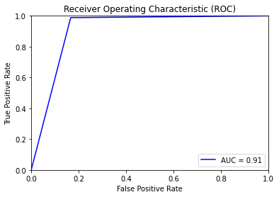
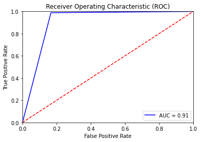

# HDAI 2021 주제2: 심전도 데이터셋을 활용한 부정맥 진단 AI 모델

(메모)

- 대회 종료 시 결과 요약지(양식 1 : [팀명]H.D.A.I 2021 결과 요약지.pdf)와 개발된 AI 모델을 제출합니다.
- 결과물 제출: 주제 2. 2021년 12월 2일 (목) ~ 2021년 12월 12일 (일) 23:59
- 제출처 E-mail: hdaidatathon@gmail.com

A. AI 모델 제출 : 학습코드, 모델 Weight, 환경, 모델설명(1GB 미만)<br>
** *성능평가 검증을 위한 실행 가이드를 readme.md에 작성해주시기 바랍니다.*<br>
B. 결과 요약지 : 첨부파일 양식 1. 결과 요약지(H.D.A.I 2021).doc 활용  
** *단, 결과요약지 내에 주제 1은 DSC/JI , 주제 2는 AUC 출력값이 보이도록 스크린샷 첨부* <br>

**[TO-DO] source_arranged는 나중에 지울 것, ~~train.py~~랑 ~~전처리 코드 수정~~, ~~검증 코드 추가~~**

# 실행 가이드

## 0. Requirements

모델 weights는 따로 구글 드라이브 링크 (추후에)

<!--## 실행 방법-->

## 1. 데이터 전처리

저희는 모든 입력 데이터를 (12, 4096) 형태로 바꾸고 이를 넘파이 배열 파일로 저장하도록 전처리 작업을 수행하였습니다.<br>
레이블의 경우, 주어진 데이터가 정상 또 비정상으로 분류되어 제공되었으므로 각 데이터 개수에 맞춰 정상=0, 비정상=1로 인코딩한 리스트를 만들고 합쳐서 넘파이 배열을 저장하도록 만들었습니다.

### DataPreprocess

> path_arr, path_nor, data_filename='./data', label_filename='./label', data_type='test'

- `path_arr`과 `path_nor`는 각각 비정상 데이터와 정상 데이터가 저장된 경로입니다.
- 전처리된 데이터는 넘파이 배열 파일인 `.npy` 파일로 저장되는데, `data_filename`과 `label_filename`은 저장하고 싶은 데이터 및 레이블의 파일명을 의미합니다.
- `data_tye`은 'train', 'valid', 'test'로 세 가지 데이터의 종류에 맞춰 전처리 작업을 수행하도록 합니다.

```python
from utils.data_preprocess import DataPreprocess

DataPreprocess(path_arr='electrocardiogram/data/test/arrhythmia/',
               path_nor='electrocardiogram/data/test/normal/',
               data_filename='./test_data', label_filename='./test_label')
```

## 2. 검증 방법

`test_modules` 모듈 안에 `predict`, `print_scores`, `plot_roc_curve` 메서드를 정의했습니다.

```python
from test_modules import predict, print_scores, plot_roc_curve
```

### predict(model, data_path='./data.npy', label_path='./label.npy') -> y_target, y_predicted

정답과 예측 결과를 함께 반환하는 메서드입니다.<br>
이 메서드를 사용하기 위해서는 전처리 작업을 마친 npy 파일이 있어야 하고, 모델을 먼저 불러와야 합니다.

```python
import torch

device = torch.device('cuda:0' if torch.cuda.is_available() else 'cpu')

# 모델 불러오기
from models.resnet import resnet34

model = resnet34()
model.load_state_dict(torch.load('./weights/epoch_100_model_trial_1', map_location=torch.device(device)))

# 전체 테스트 데이터셋에 대한 정답과 예측 결과를 반환합니다.
y_target, y_predicted = predict(model, data_path='./valid_data.npy', label_path='./valid_label.npy')
```

### print_scores(y_target, y_predicted) -> None

score를 출력하는 메서드입니다.

```python
print_scores(y_target, y_predicted)
```

예상 결과:

```
Area Under the Curve (AUC): 0.910897826268664
Average Precision: 0.8297747025201556
Accuracy Score: 0.904507100226384
Recall Score: 0.9883355764917003
Precision Score: 0.8341537296478606
F1 Score: 0.9047227926078029
```

### plot_roc_curve(y_target, y_predicted, guideline=False, save_png=True) -> None

ROC 커브를 그려주는 메서드입니다. `save_png=True`로 놓으면 ROC 커브의 이미지가 png 파일로 저장됩니다.<br>

```python
plot_roc_curve(y_target, y_predicted, guideline=False)
```



```python
plot_roc_curve(y_target, y_predicted, guideline=True)
```



<!--## 간단한 사용 방법-->

<!--### 코드 라이센스-->
